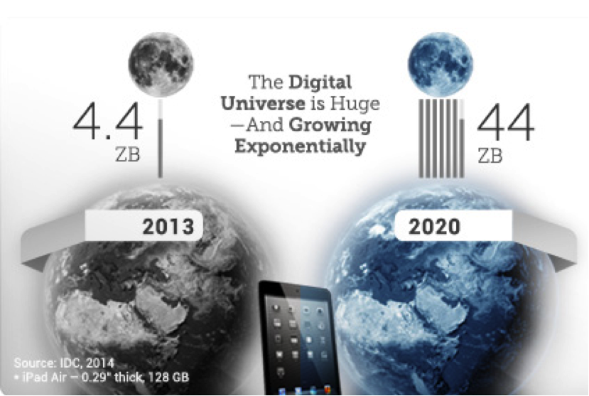
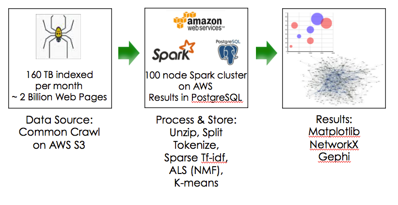
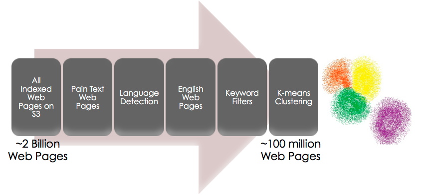
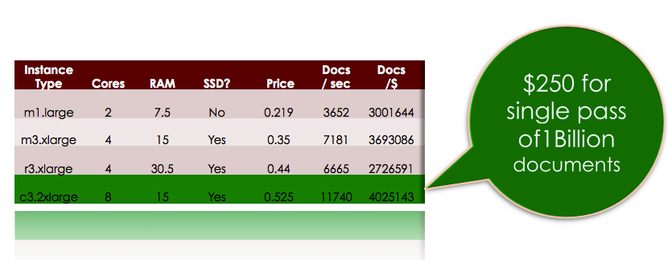
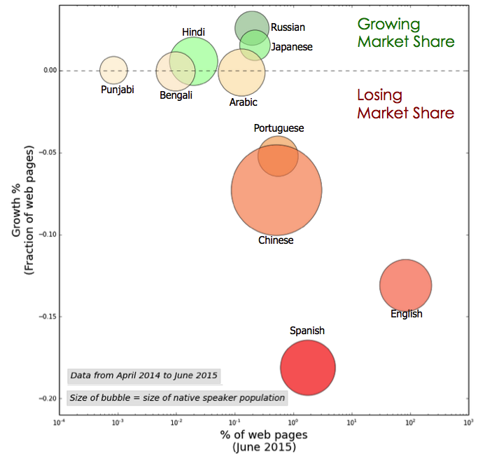
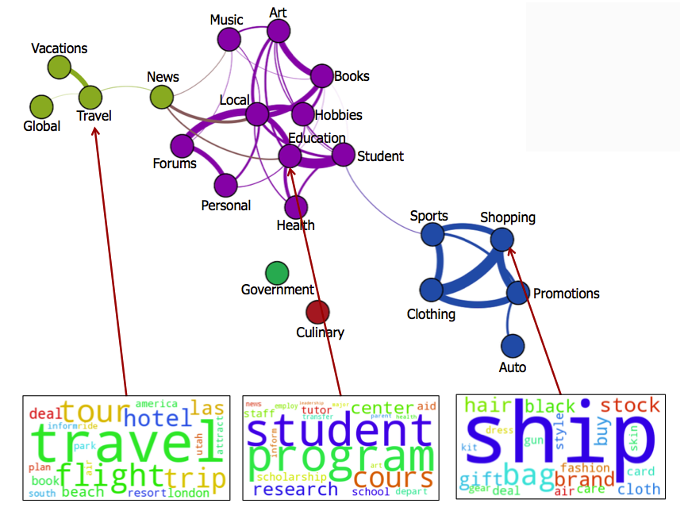

# Web Scale Natural Language Processing
Web Scale Natural Language Processing is a big data engineering and machine-learning project using Apache Spark to create extract insights from multi-billion document, multi-terabyte corpus like common crawl.

##Background
Digital content is growing exponentially. In 2013 4.4 ZB (ZB = 1 Billion Terabyte) of digital content was produced*. By 2020, the amount of digital content produced will grow to 44 ZB. That's a ten-fold increase in seven years. Scalable cloud based infrastructure and machine learning are an extremely good fit for processing such vast quantities of data.

* [EMC Digital Universe Study](http://www.emc.com/leadership/digital-universe/index.htm)

   
   
##Solution Landscape
Solution Landscape for this project consited of AWS S3 hosted Common Crawl public dataset as the source of data, 100 node Apache Spark cluster as the processing engine and PostgreSQL as the repository of processed results. Final data visualization is done using Matplotlib, NetworkX and Gephi.

##Spark AWS ML Pipeline

Each source data file was approximately 120 MB zipped and 300 MB unzipped. Each file contained on the order of 90,000 documents. These files were unzipped on the fly and document extracted using a Spark RDD mapping. After document extraction, document tokenization was performed and converted into a sparse vector using predefined but configurable vocabulary. These sparse vectors were then converted into inverse-document-frequency (idf) vector and finally into a term frequency–inverse document frequency (tf-idf) using Spark MLlib IDF class. Finally the tf-idf matrix was used to train a k-means model using Spark MLlib KMeans, KMeansModel classes.

Once k-means model was trained, keywords and weights associated with keywords were extracted from the clusters generated by k-means model. Optionally, a second pass on the data was performed to extract top documents associated with each cluster.

##AWS Benchmarks
Amazon Web Services (AWS) provide a number of possible configurations for creating Elastic Map Reduce (EMR) cluster. Before submitting a large cluster-processing job, it is prudent to benchmark cluster performance to choose optimal cluster configuration and get an expectation on price and performance characterstics. Below is a summary of the AWS cluster performance analysis done to finalize cluster configuration:

##Results

###Increasing Language Diversity of the web
As part of preprocessing for clustering process, language detection was performed on each document using [langid](https://github.com/saffsd/langid.py) pre-trained model. These language codes were accumulated using Spark accumulator objects for further analysis and finally saved in PostgreSQL database once the clustering job completed. Visualization below depicts the result of the analysis of language data:

Only top ten languages of the web by market share are included in above graph.

Key takeaway from the above analysis are:

* English still is the dominant language of the web with about 84% market share (please note that x-axis in on log scale)  
* Russian, Japanese and Hindi are gaining market share  
* Spanish, English, Chinese and Portuguese are losing market share  

Please note that this is a statement on market share not growth within a particular language. For example, number of English language pages continue to increase even as English is losing market share. This is more a phenomenon of rise of other languages and not so much as decrease in popularity of English.

###K-means clusters
Following visualization depicts k-means clusters achieved from this analysis. The word-cloud at the bottom on the visualization depicts top keywords for key clusters scaled using weight of each word. Word cloud was generated using python word [cloud module](https://github.com/amueller/word_cloud) contributed by Andreas Muller. The graph on the top was produced by creating a NetworkX graph and exporting the the graph in .gexf format followed by analysis and transformation in Gephi. 

Key takeaways:

* Cohesive clusters were achieved on web scale using MLlib k-means clustering algorithm
* Multiple cluster communities were identifiable by using modularity calculations within Gephi software
* Thickness of lines between cluster represents the strength of relationship between clusters calculated using Jaccard similarity coefficient

##Potential use cases:

The analysis above could be used to implement following potential use cases:

* Brand surveillance
* Content market segmentation
* Ad keyword substitution
* Emerging markets surveillance

